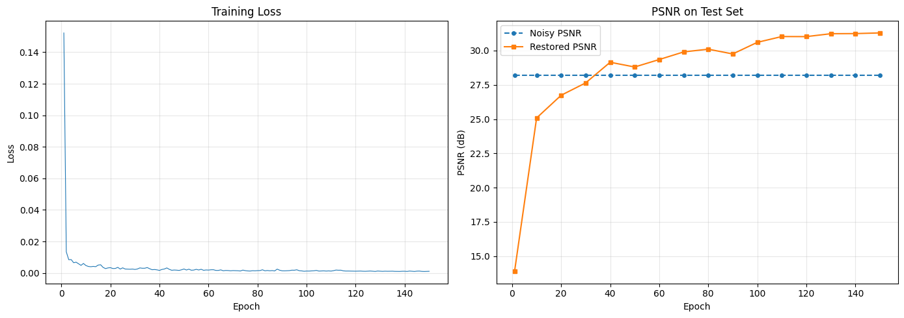

# Deep Learning for Imaging — Denoising, Classification & Detection

Three PyTorch projects from Intelligent Visual Signal Understanding (ELEC5304, University of Sydney, 2026).

## 1. Image Denoising Network

A 17-layer residual CNN that predicts the noise map and subtracts it, trained for 150 epochs on 350 grayscale 180×180 images and evaluated on a held-out 50.

| Test set | PSNR before | PSNR after | Change |
|---|---|---|---|
| Gaussian σ = 10 (training distribution) | 28.21 dB | 30.32 dB | **+2.10 dB** |
| Speckle σ = 0.10 | 26.23 dB | 28.19 dB | +1.96 dB |
| Speckle σ = 0.06 | 30.57 dB | 30.78 dB | +0.21 dB |
| Speckle σ = 0.04 | 34.04 dB | 31.22 dB | **−2.82 dB** |



The last row is the interesting one. On a lightly corrupted image the network makes it *worse* by 2.82 dB: it has learned corrections calibrated for a specific noise magnitude and applies them regardless, so a clean input gets over-processed. The generalisation from additive Gaussian to multiplicative speckle holds only where the corruption magnitude is close to what it trained on.

An earlier shallower version sat below the noisy baseline entirely — restored PSNR around 26 dB against a 28.21 dB input — meaning it was degrading every image it touched until the depth increased.

## 2. CIFAR-10 Classification Network

Two networks against two different objectives, which turned out to need two different optimisers.

| Model | Test accuracy | Target | Wall clock |
|---|---|---|---|
| A (ResNet-20, SGD, 50 epochs) | **91.31%** | > 80% | — |
| B (FastCIFARNet, AdamW + AMP, 3 epochs) | **77.09%** | ≥ 70% in 60 s | 57.3 s |

Model A's best validation accuracy (91.79%), final validation (91.71%) and held-out test accuracy (91.31%) land within half a point of each other, so it is not overfitting the validation split.

Model B exists because the 60-second budget is not a smaller version of the same problem. A GPU-bound data pipeline puts a floor of 16–18 seconds on each epoch, which caps training at three epochs and roughly 1,000 update steps — and SGD does not converge meaningfully in 1,000 steps. Swapping to AdamW with a high maximum learning rate, mixed precision and label smoothing was the only way to reach 70% inside the budget. The cost shows up per class: on `cat`, Model B loses over 20 percentage points relative to its own average.

## 3. Customised Faster R-CNN — PASCAL VOC 2007 Object Detection

Fine-tuned Faster R-CNN for 20-class detection on the official VOC 2007 splits, 6 epochs with a warmup-plus-cosine schedule and mixed-precision training.

| Metric (official 4,952-image test split) | Value |
|---|---|
| VOC 11-point interpolated mAP@0.5 | **0.8521** |
| COCO 101-point mAP@0.5 | **0.8966** |
| Assignment target | 0.60 |

Training loss fell monotonically from 0.4552 to 0.1407 across the six epochs, but validation mAP peaked at epoch 5 (0.8974) and dropped at epoch 6 — so the epoch-5 checkpoint was saved rather than the final one. Mixed precision cut the training phase to about 95 minutes on a Colab T4. A failure analysis over the full test set covers the dominant error modes.

## Repo contents

| Path | Description |
|---|---|
| `notebooks/image_denoising.ipynb` | Denoising pipeline |
| `notebooks/cifar10_classification.ipynb` | Both CIFAR-10 models |
| `notebooks/voc2007_faster_rcnn.ipynb` | Faster R-CNN detection |
| `docs/` | Project reports, including the 12-page Faster R-CNN paper |

Notebook outputs are stripped; the figures above come from the reports in `docs/`.

## Run it

```bash
pip install -r requirements.txt
jupyter notebook notebooks/
```

Datasets download automatically inside the notebooks (CIFAR-10/VOC via torchvision; denoising set via in-notebook command).

## Limitations

- The denoiser is tied to the noise level it trained on, as the σ = 0.04 row shows. It is not a general restoration model.
- Model B's 57.3 s figure is specific to a Colab T4 with that data pipeline; the budget is hardware-dependent.
- VOC 2007 is a small, well-studied benchmark and these numbers do not transfer to detection in the wild.

## Context

Group projects with Hilal Chamtie, Darin Li, and Akshar Hossain. Course mark 88 HD.
